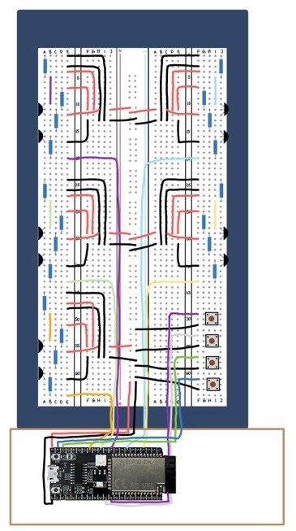
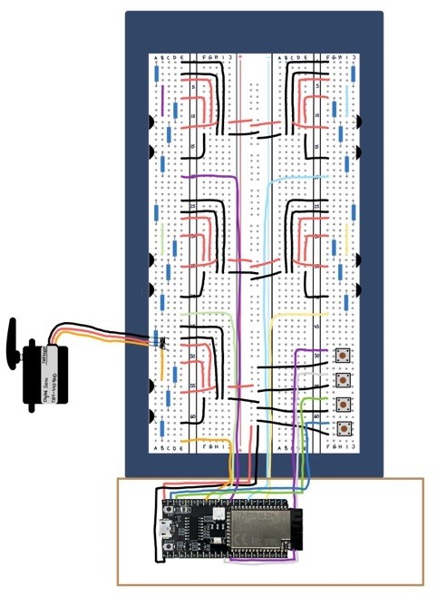

# Servo Dokumentation

**Nora Hüppi**  
**Hard- und Software Technik**  
**EN22a**

1. **Was ist ein Servo-Motor und wo wird dieser eigesetzt?**  
Ein Servo Motor wandelt elektrische Energie in mechanische Energie um. Diese Art von Motor wird für eine genaue Steuerung verwendet und man kann dazu verschiedene Anbauteile damit verbinden, Man kann die Position eines Servomotors mit einem Controller ansteuern zum Beispiel ist dies der Fall bei der Lenkung von ferngesteuerten Autos einsetzbar, bei Robotik oder auch bei Automatisierung Technik. Wenn man einen Gleichstrommotor an eine Stromquelle anschliessen dreht sich dieser die ganze Zeit aber bei einem Servo Motor ist das anders er dreht sich nicht sofort, wenn eine Spannung anliegt, sondern er empfängt er die Signale, die den Motor genau sagen, wie weit er sich drehen soll. Eigentlich dreht sich der Motor nur 180 Grad, aber man kann auch kleiner oder grössere werte bekommen. Es gibt auch verschiedene Modelle wie zum Beispiel Close Loop Modelle also einfach mit Geschlossener Regelkreis. Also normalerweise befindet sich drin im Loop so ein Stift, dass eine zu weite Drehung des Motors verhindert. Manche haben aber den Stift nicht, was so viel heisst, dass sich der Stift um 360 Grad drehen kann das wären dann Motoren mit Offener Regelkreis.

2. **Wie Funktioniret ein Servo-Motor?**  
Der Servo-Motor erzeugt Spannung, Geschwindigkeit und Drehmomente. Dieser Motor arbeitet nur als Teil von einem geschlossenen Regelkreissystem. Dieses Regelkreissystem liefert Geschwindigkeit und auch Drehmomente. Dies wird vom Servoregler vorgegeben und dann für das Schliessen des Systems wird ein Rückfahrsysteme genutzt. Das System hier ist in der Lage, Informationen über den Strom und der Geschwindigkeit zu liefern.

3. **Was ist ein PWM-Signal?**  
Ein PWM-Signal oder besser gesagt ein Pulsweitenmodulation-Signal dient zum Ansteuern von zum Beispiel Glühbirnen oder auch eben Servo-Motoren also allgemein dient es zur Ansteuerung von Aktoren, die aber nicht dauerhaft gestromt werden sollen oder können. Und ein PWM ist ein Signal, das aus einer Abfolge von kurzen Pulsen besteht. Die Breite der Pulse ändert sich, um verschiedene Informationen zu übertragen. Zum Beispiel wird PWM auch oft verwendet, um die Helligkeit von LEDs oder die Geschwindigkeit eben von Motoren zu steuern, wie oben schon erwähnt. Und jetzt zum Beispiel möchte ich die Helligkeit eben von einer LED steuern. Anstatt die LED einfach Ein oder Auszuschalten, wird die Pulsbreite verändert. Eine längere Pulsbreite bedeutet eine höhere Helligkeit, während eine kürzere Pulsbreite eine geringere Helligkeit ergibt. Das ermöglicht eine Präzise Steuerung.

4. **Wie wird ein Servo angesteuert?**  
Ein Servo wird über ein Steuersignal angesteuert, das normalerweise ein PWM-Signal ist. Das Steuersignal besteht aus einer Serie von Pulsen, bei denen die Pulsbreite die Position des Servos bestimmt. Wenn das Steuersignal eine kurze Pulsbreite hat, dreht sich der Servo in eine Richtung. Bei einer längeren Pulsbreite dreht er sich in die andere Richtung. Die Mitte des Steuersignals entspricht der Neutralen Position des Servos. So kann man die Position des Servos präzise steuern.

5. **Ansteuerung und Messmittel**  
    - ESP32
    - PlatformIO
    - Streckbrett
    - 5 Servos  

6. **Aufbau**  
    - **Blockschaltbild**  
          
    - **Schema**  
          

7. **Aufgabe A**
    - **Aufgabenstellung**  
        Beim Einschalten fährt der Servo auf 90°.  

    - **Schema**  
          
        
    - **Programmbeschreib**  
        Wenn das Servo strom bekommt fährt das Servo auf 90°.  

    - **Bedienung und Test**  
        | Eingang| Ausgang            | Funktioniert?|
        |-------:|-------------------:|-------------:|
        | Aus    | servo aus          | Ja           |
        | Ein    | servo fährt auf 90°| Ja           |  

8. **Aufgabe B**
    - **Aufgabenstellung**  
        Mit Bit0=0 fährt der Servo auf 0°, mit Bit0=1 auf 180°.  

    - **Schema**  
          
        
    - **Programmbeschreib**   
        Wenn ein Flanke vom Knopf ButtonMove180 erkannt wird fährt das Servo auf 180°.
        Wenn eine Klanke vom Konopf ButtonMove0 erkannt wird dann fährt das Servo auf 0°.  

    - **Bedienung und Test**  
        | Eingang      | Ausgang             | Funktioniert?|
        |-------------:|--------------------:|-------------:|
        | ButtonMove180| servo fährt auf 180°| Ja           |
        | ButtonMove0  | servo fährt auf 0°  | Ja           |  

9. **Aufgabe C**
    - **Aufgabenstellung**  
        Der Servo fährt 10 vorgegebene Zeigerstellungen an.  

    - **Schema**  
          
        
    - **Programmbeschreib**  
         Wenn das Servo strom hat dann fährt das Servo 10 vordefinierte positionen ab.  
         
    - **Bedienung und Test**  
        | Eingang| Ausgang                     | Funktioniert?|
        |-------:|----------------------------:|-------------:|
        | Aus    | servo aus                   | Ja           |
        | Ein    | servo fährt 10 positionen ab| Ja           |  

10. **Aufgabe D**
    - **Aufgabenstellung**  
        Mit Bit0 und Bit1 wird die Zeigerstellung verändert. Dabei darf der zeiger den Bereich 0°...180° nicht verlassen.  

    - **Schema**  
          
        
    - **Programmbeschreib**  
       Solange ButtonMove180 gedrückt ist, fährt das Servo von 0° zu 180°. Wenn ButtonMove180 losgelassen wird bleibt das Servo stehen.
       Wenn ButtonMove0 gedrückt ist dann fährt das Servo von 180° zu 0° und auch hier bleibt das Servo stehen wenn ButtonMove0 losgelassen wird. 
       Es macht 1° schritte. 

    - **Bedienung und Test**  
        | Eingang                     | Ausgang                  | Funktioniert?|
        |----------------------------:|-------------------------:|-------------:|
        | ButtonMove180 gedrückt      | Servo fährt richtung 180°| Ja           |
        | ButtonMove180 nicht gedrückt| Servo bleib stehen       | Ja           |
        | ButtonMove0 gedrückt        | Servo fährt richtung 0°  | Ja           |
        | ButtonMove0 nicht gedrückt  | Servo bleib stehen       | Ja           |  

 12. **Aufgabe E**
     - **Aufgabenstellung**  
        Mit Bit0 und Bit1 wird die Zeigerstellung verändert. Dabei darf der Zeiger den Bereich 0°...180° nicht verlassen, aber           nach bestätigung von Bit0 oder Bit1 ist die Drehgeschwindigkeit zuerst langsam, nach 1s zunehmend schneller. (Tip: Zeit          erst nach 10-facher Wiederholung ändern).

     - **Schema**  
        

     - **Programmbeschreib**  
        Wie bei Aufgabe D fährt das Servo von 180° zu 0° wenn ButtonMove0 gedrückt ist und wenn der Knopf losgelassen wird dann bleibt das Servo Stehen, und umgekehrt wenn ButtonMove180 gedrückt und losgelassen wird.  
        Es fährt immernoch in 1° schritten in beide richtungen. Nur diesesmal wird die rotation nach 10 wiederholungen immer schneller.

     - **Bedienung und Test**
        | Eingang                     | Ausgang                   | Funktioniert?|
        |----------------------------:|--------------------------:|-------------:|
        | ButtonMove180 gedrückt      | Servo fährt richtung 180° | Ja           |
        | ButtonMove180 nicht gedrückt| Servo bleib stehen        | Ja           |
        | ButtonMove0 gedrückt        | Servo fährt richtung 0°   | Ja           |
        | ButtonMove0 nicht gedrückt  | Servo bleib stehen        | Ja           |
        | counter hat auf 10 gezählt  | Servo dreht sich schneller| Ja           |  
          
12. **Aufgabe F**  
    - **Aufgabenstellung**  
        Mit Bit0 nd Bit1 wird die Zeigerstellung verändert. Dabei darf der Zeiger den Bereich 0°..180° nicht verlassen, aber nach bestätigung von Bit0 oder Bit1 ist die Drehgeschwindigkeit zuerst langsam, nach 1s zunehmend schneller. (Tip: Zeit erst nach 10-facher Wiederholung ändern), jedoch gewünschte Zeigerstellung mit Bit2 speichern. Es können max. 10 Zeigerstellungen gespeichert werden Start der Robotertätigkeit mit Bit3.  

    - **Schema**  
          
        
    - **Programmbeschreib**   
        Wie bei Aufgabe D fährt das Servo von 180° zu 0° wenn ButtonMove0 gedrückt ist und wenn der Knopf losgelassen wird dann bleibt das Servo Stehen, und umgekehrt wenn ButtonMove180 gedrückt und losgelassen wird.  
        Es fährt immernoch in 1° schritten in beide richtungen. Nur diesesmal wird die rotation nach 10 wiederholungen immer schneller.
        Zusätzlich kann man auf ButtonSave drücken und wenn dort eine Flanke erkannt word speichert es die Position an der das Servo gerade steht.
        Wenn mann 10 Positionen gespeichert hat dann kann man auf ButtonStart drücken und wenn dort eine Flanke erkannt wird dann fährt das Servo die gespeicherten Positionen ab.  
        
    - **Bedienung und Test**  
        | Eingang                     | Ausgang                                    | Funktioniert?|
        |----------------------------:|-------------------------------------------:|-------------:|
        | ButtonMove180 gedrückt      | Servo fährt richtung 180°                  | Ja           |
        | ButtonMove180 nicht gedrückt| Servo bleib stehen                         | Ja           |
        | ButtonMove0 gedrückt        | Servo fährt richtung 0°                    | Ja           |
        | ButtonMove0 nicht gedrückt  | Servo bleib stehen                         | Ja           |
        | counter hat auf 10 gezählt  | Servo dreht sich schneller                 | Ja           | 
        | ButtonSave flanke erkannt   | Speichert position von Servo               | Ja           |
        | ButtonStart flanke erkannt  | Servo fährt die gespeicherten positionen ab| Ja           |  

13. **Aufgabe G**
    - **Aufgabenstellung**  
        Eigene Varianten und Ideen.  

    - **Schema**  
         
    - **Programmbeschreib**  
        Wenn beim ButtonMove180 eine Flanke erkannt wird dann fährt der Arm an eine stelle könnt einen Stift aufheben und den Stift an einer anderen stelle wieder absetzten.
        Wenn beim ButtonMove0 eine Flanke erkannt wird macht es das gleiche nur von zweiten Punkt zum ersten.

    - **Bedienung und Test**  
        | Eingang                     | Ausgang                      | Funktioniert?|
        |----------------------------:|-----------------------------:|-------------:|
        | ButtonMove180 Flanke erkannt| Servos fahren einen ablauf ab| Ja           |
        | ButtonMove0 Flanke erkannt  | Servos fahren einen ablauf ab| Ja           |  

14. **Fazit**  
    Ich habe gelernt mit einem ESP32 zu programmieren. PlattformIo habe ich näher kennengelernt. Dazu habe ich mich sehr mit Mark Downs auseinandergesetzt.
    Ich habe gelernt wie ich ein 3.3V Signal auf ein 5V signal hochziehen kann.
